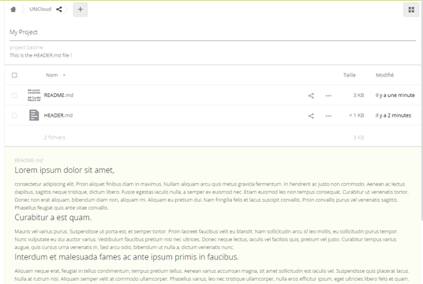

Files README.md
---

Show README.md & HEADER.md gitlab style on your NextCloud !

With this app you can add a header and a footer to your nextcloud directories.
This can be use to explain the goal of a directory, describe the content of a folder ...

It show README.md in the way gitlab does.

# Usage 

  * Create a README.md file (case sensitive name) and fill it with the apropriate Markdown content.
  * You can do the same with the HEADER.md file.
  * It's rendered using the same markdown engine as the app. Before file list for the HEADER.md, after file list for the README.md
  * You can now use .README.md & .HEADER.md .It means that you can now hide those files.
  * It render now in public shared !

Now you can use template to customize the README.md/HEADER.md rendering.

  * Create your own theme and use your own content.css (see css/content.css file)
  * Rendering is done inside a div contenair with headermd or readmemd class.

 
